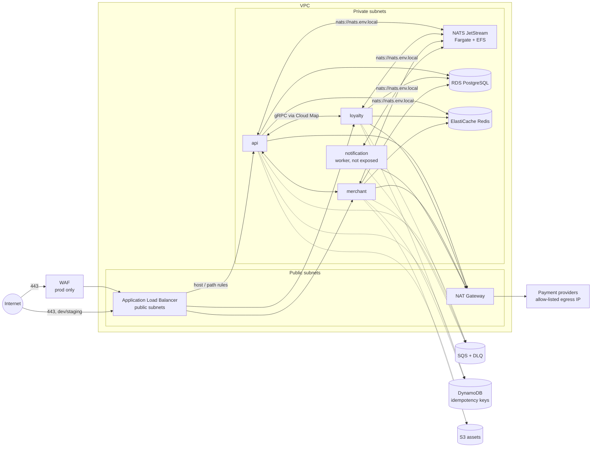

# Architecture

LoyaOne is a card-linked loyalty platform: a small set of NestJS microservices behind one
load balancer, talking to PostgreSQL, Redis and NATS JetStream, with SQS for work that must
survive a crash and DynamoDB for idempotency keys. This document explains the shape and the
reasons, so the next engineer can change it with confidence.

## Topology

Nothing in a private subnet has a public IP. The only inbound path is the ALB, and the
only outbound path is the NAT gateway, whose Elastic IP is what payment providers allow-list.

## Stacks and state

| Stack | State key | Applied |
|---|---|---|
| `global/s3-backend` | local, then never again | once, by hand |
| `global/kms` | `global/kms` | rarely |
| `global/ecr` | `global/ecr` | when a service is added |
| `environments/dev` | `envs/dev` | on every merge |
| `environments/staging` | `envs/staging` | on every merge |
| `environments/prod` | `envs/prod` | manually approved |

Environments are three copies of one `main.tf`. Everything that differs lives in
`locals.tf`, so a diff between `dev/locals.tf` and `prod/locals.tf` is the complete
list of ways prod is different. That is deliberate: it is the question every incident
review asks.

## Decisions

**Fargate, not EKS.** The README of the first version of this repo listed an EKS module.
Four engineers do not need a Kubernetes control plane to run six containers. Fargate
gives per-task IAM, no hosts to patch, and a deployment circuit breaker that rolls back a
bad release without anyone being paged. If the service count passes twenty or we need
sidecars and custom schedulers, EKS becomes worth its cost; not before.

**Cloud Map for service discovery, not an internal ALB.** Services call each other over
gRPC by hostname (`loyalty.loyaone-prod.local`). An internal load balancer would add cost
and a hop for no benefit at this scale; ECS keeps the DNS records current.

**NATS JetStream as one Fargate task on EFS.** Streams need a disk that survives task
restarts, and EFS is the only Fargate-compatible persistent volume. One node handles
LoyaOne's current throughput comfortably. The known limit is that a restart is a short
outage for consumers; the next step, when the volume justifies it, is a three-node
cluster with routes on 6222, which is a change to `modules/nats` and nothing else.

**RDS manages the master password.** `manage_master_user_password = true` means the
password is generated by Secrets Manager, rotated there, and never appears in Terraform
variables, state or CI logs. Services receive `DB_USERNAME` and `DB_PASSWORD` at task
start via the ECS `secrets` mechanism, referencing JSON keys inside that one secret.

**Spot in dev, on-demand in staging and prod.** `FARGATE_SPOT` is roughly 70% cheaper
and dev does not care about the occasional interruption. Staging runs on-demand so that
release rehearsals behave like prod.

**Separate KMS key per environment, held in the global stack.** Destroying and
rebuilding dev must not make prod snapshots unreadable, and vice versa. Keys outlive
environments, so they cannot live inside them.

**Idempotency keys in DynamoDB, not Redis.** Redis is configured to evict under memory
pressure (`allkeys-lru`), which is right for a cache and wrong for a record that says "we
already charged this card". DynamoDB with TTL costs almost nothing at this volume and
never evicts.

**Every queue has a dead-letter queue and an alarm on it.** A message that fails five
times stops retrying and someone gets told. Retrying forever hides bugs and burns money.

**GitHub Actions deploys through OIDC.** No long-lived AWS keys in repository secrets.
The deploy role can push images and update ECS services; it cannot touch RDS, IAM or
networking. Terraform itself is applied by a separate, more privileged role that only
the `plan` job in CI assumes read-only.

## Cost, roughly (eu-west-2, on-demand list prices)

| | dev | prod |
|---|---|---|
| NAT gateway | ~35 USD | ~35 USD |
| ALB | ~20 USD | ~25 USD |
| Fargate (4 services, small) | ~25 USD (Spot) | ~150 USD |
| RDS | ~15 USD (t4g.micro) | ~250 USD (r6g.large Multi-AZ) |
| Redis | ~12 USD | ~200 USD (2 x r6g.large) |
| NATS task + EFS | ~20 USD | ~25 USD |
| WAF | 0 | ~10 USD |
| **Total** | **~130 USD/month** | **~700 USD/month** |

The NAT gateway is the one line that surprises people. It is the price of not giving
containers public IPs.

## What is not here yet

- Route 53 records and ACM certificate creation (certificates are passed in by ARN)
- NATS clustering
- Read replicas for RDS
- Cross-region backup copies
- A CloudWatch dashboard (alarms exist; a dashboard is a nice-to-have)
